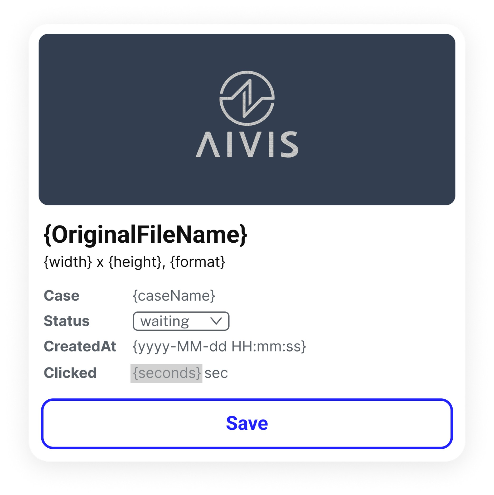

# 🚀 AIVIS 2025 H2 Front-End Coding Test

이 저장소는 AIVIS 프론트엔드 개발자 채용을 위한 코딩 테스트 템플릿입니다.

지원자는 본 저장소를 개인 GitHub 저장소에 **fork** 혹은 **clone** 후, 아래 과제를 자유롭게 구현해 주세요.

제한시간은 없습니다. 모든 항목에 대한 구현이 왼료된 경우 담당자에게 말씀하시고 종료하시면 됩니다.

---

## 📌 프로젝트 개요

- **기술 스택**: React 기반
  (상태 관리, 라우팅, 스타일링 등을 위한 프레임워크나 라이브러리는 자유롭게 사용 가능합니다)
- **목적**: 실무와 유사한 UI 구성 능력, 컴포넌트 설계, 상태 관리, API 활용 등을 종합적으로 평가합니다.

---

## 🛠 구현 과제

### 1. 로그인 페이지

- 제공된 ID / Password를 입력하여 로그인할 수 있는 페이지를 구현합니다.
- 로그인 성공 시 이미지 리스트 페이지로 이동합니다.

### 2. 이미지 리스트 페이지

[2-1. Card component](#card-component)와 유사한 스타일의 이미지 카드 리스트를 구현합니다.

각 카드는 **drag & drop**으로 순서(위치)를 변경할 수 있어야 하며, 다음 기능을 포함해야 합니다:

#### 2-1. Card Component

<div align="center">
    
</div>

- **메인 이미지**: 
  `{S3_URL}/{s3Path}` 경로를 통해 이미지를 가져옵니다.
- **카드 정보 출력**: 
  API 응답값을 바탕으로 카드 내용을 구성합니다.
- **Status 변경**: 
  드롭다운을 통해 {status}값을 변경할 수 있습니다.(`waiting`, `completed`, `failed`)
- **이미지 모달**: 
  메인 이미지를 클릭하면 확대된 이미지가 모달로 표시됩니다.
- **클릭 시간 기록**: 
  카드가 클릭되어있는 시간을 초 단위로 측정하고 `{seconds}` 값을 변경합니다.
- **Save 버튼**: 
  status 및 timer 값을 API를 통해 저장합니다.

### 3. README 작성

프로젝트에 대한 전반적인 설명(기술 스택, 실행 방법 등)과 본인이 기술하고 싶은 내용을 별도의 README 파일로 작성합니다.

---

## 🔗 참고 자료

- **S3 URL**
  `https://dev-patho.s3.ap-northeast-2.amazonaws.com`
- **API Base URL**
  `https://dev-eks-api.patho.kr`

> *아래 명세는 과제 구현에 필요한 속성만 발췌한 예시입니다.*

### 1. 로그인 API

- **Endpoint**: `/v2/users/login`
- **Method**: `POST`
- **Request**
    ```json
    {
      "email": "string",
      "password": "string"
    }
    ```
- **Response**
    ```json
    {
      "accessToken": "string",
      ...
    }
    ```

---

### 2. 이미지 리스트 API

- **Endpoint**
  `/v1/micro/cases/{caseId}`
- **Method**: `GET`
- **Authorization**: Bearer Token (`accessToken`)
- **Response**
    ```json
    {
      ...
      "images": [
        {
          "_id": "string",
          "caseName": "string",
          "status": "string",
          ...
          "originalFileName": "string",
          "info": {
            "format": "string",
            "width": number,
            "height": number,
            ...
          },
          "createdAt": "string",
          ...
          "s3Path": "string",
          ...
        }
      ],
      ...
    }
    ```

---

### 3. 클릭 시간 API

- **GET method endpoint** `/v1/timer/{imageId}`
- **POST method endpoint** `/v1/timer`
- **Authorization**: Bearer Token (`accessToken`)

- **GET Response**
    ```json
    {
      "imageId": "string",
      "seconds": "string",
      ...
    }
    ```

- **POST Request**
    ```json
    {
      "imageId": "string",
      "seconds": "string"
    }
    ```

- **POST Response**
    ```json
    {
      "imageId": "string",
      "seconds": "string",
      ...
    }
    ```

---

### 4. Status 변경 API

- **Endpoint**
  `/v1/micro/images/{imageId}/status?status={value}`
- **Method**: `PATCH`
- **Authorization**: Bearer Token (`accessToken`)
- **Query Parameter**: `status` (`waiting`, `completed`, `failed`)
- **Response**
    ```json
    {
      "message": "string"
    }
    ```

---

## 📮 제출 방법

모든 구현 내용 push 완료 후 개인 저장소 링크를 **hcan@aivis.kr**로 전달합니다.

> ***fork**가 아닌 **clone**하여 개인 저장소에 private 권한으로 생성한 경우 **hcan@aivis.kr** 계정을 collaborators에 초대해주셔야 확인 가능 합니다.*

---

## 🔍 평가 항목

아래 항목 위주로 평가가 이루어집니다:

- 과제의 **요구사항이 충실히 반영**되어 있는지
- 코드의 **재사용성과 구조화**가 잘 되어 있는지
- **상태 관리 도구**나 **Custom Hook** 등을 효과적으로 활용했는지

## 💡 우대 사항

아래 항목을 반영한 경우 가산점이 부여됩니다:

- 주요 기능에 대한 **에러 처리** 및 사용자 친화적 설계
- **Git 커밋 관리** 및 작업 내역 정리가 잘 되어 있는 경우
- 웹 서비스 배포를 위한 **Docker 컨테이너화 (Dockerfile)**

---

감사합니다. 멋진 결과를 기대하겠습니다!
